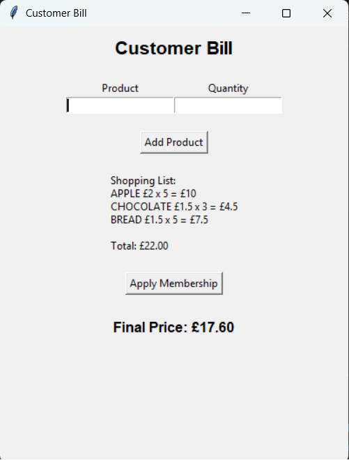
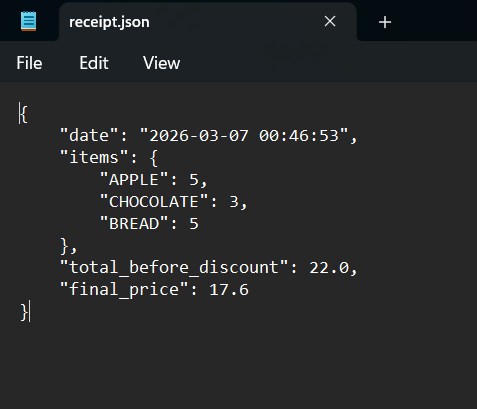

# Supermarket Cashier Software

## Overview

Supermarket Cashier Software is a desktop billing application built with **Python and Tkinter** that simulates a basic supermarket point-of-sale (POS) system.
The application allows a cashier to add products to a customer's cart, calculate totals, apply membership discounts, and generate a digital receipt stored in JSON format.

This project demonstrates practical usage of:

* Python object-oriented programming
* GUI development with Tkinter
* JSON file handling
* Basic retail pricing logic
* Data persistence

The system loads available products from a local JSON file and dynamically calculates the total price based on quantity and membership discount rules.

---

## Project Screenshots

### Application Interface



### Example Receipt Output



---

## Features

### Product Management

Products are loaded from a local JSON file (`products.json`).
Each product has a name and price.

Example:

```json
{
  "MILK": 1.50,
  "BREAD": 1.20,
  "EGGS": 2.10
}
```

The cashier enters a product name and quantity to add it to the customer's cart.

---

### Shopping Cart System

The program maintains an in-memory shopping cart using a Python dictionary:

```python
self.shopping_cart = {
    "MILK": 2,
    "BREAD": 1
}
```

Each time an item is added:

* Quantity is updated
* The running total price is recalculated
* The GUI display is refreshed

---

### Membership Discount System

Customers can receive discounts based on membership level:

| Membership | Discount |
| ---------- | -------- |
| Gold       | 20%      |
| Silver     | 10%      |
| Bronze     | 5%       |

The final price is calculated using:

```
final_price = total_price * (1 - discount)
```

---

### Receipt Generation

When a membership discount is applied, a receipt is automatically saved as a JSON file.

Example `receipt.json`:

```json
{
  "date": "2026-02-20 14:35:10",
  "items": {
    "MILK": 2,
    "BREAD": 1
  },
  "total_before_discount": 4.20,
  "final_price": 3.78
}
```

This simulates basic **transaction logging in retail systems**.

---

## GUI Implementation

The interface is built using the **Tkinter library**, Python’s built-in GUI toolkit.

Main components include:

* Labels for displaying information
* Entry widgets for user input
* Buttons for actions (add product, apply membership)
* Dynamic label updates for cart display

Key interface elements:

| Component               | Purpose                   |
| ----------------------- | ------------------------- |
| Product Entry           | Input product name        |
| Quantity Entry          | Input product quantity    |
| Add Product Button      | Add item to cart          |
| Display Label           | Show cart items and total |
| Apply Membership Button | Apply discount            |
| Final Price Label       | Show discounted price     |

---

## Project Structure

```
Supermarket-Cashier-Software
│
├── main.py
├── products.json
├── receipt.json
├── images/
│   ├── app-interface.png
│   └── receipt-example.png
└── README.md
```

---

## How to Run the Project

### 1. Clone the repository

```
git clone https://github.com/Pouya-Nasraei/Supermarket-Cashier-Software.git
```

### 2. Navigate to the project directory

```
cd Supermarket-Cashier-Software
```

### 3. Run the application

```
python main.py
```

Python 3.8 or newer is recommended.

---

## Example Workflow

1. Enter product name
2. Enter quantity
3. Click **Add Product**
4. Repeat for multiple items
5. Click **Apply Membership**
6. Enter membership type (Gold/Silver/Bronze)
7. Final price is calculated and receipt is saved

---

## Technologies Used

* **Python 3**
* **Tkinter** – GUI framework
* **JSON** – data storage
* **Datetime module** – transaction timestamps

---

## Learning Objectives

This project was developed to practice:

* Python GUI programming
* File-based data persistence
* User input validation
* Object-oriented design
* Simple retail transaction logic

---

## Possible Improvements

Future enhancements could include:

* Barcode scanning support
* Product database using SQLite
* Searchable product list
* Multiple receipts history
* Better UI design
* Inventory management

---

## Author

Pouya Nasraei
Python Developer | Software Engineer
